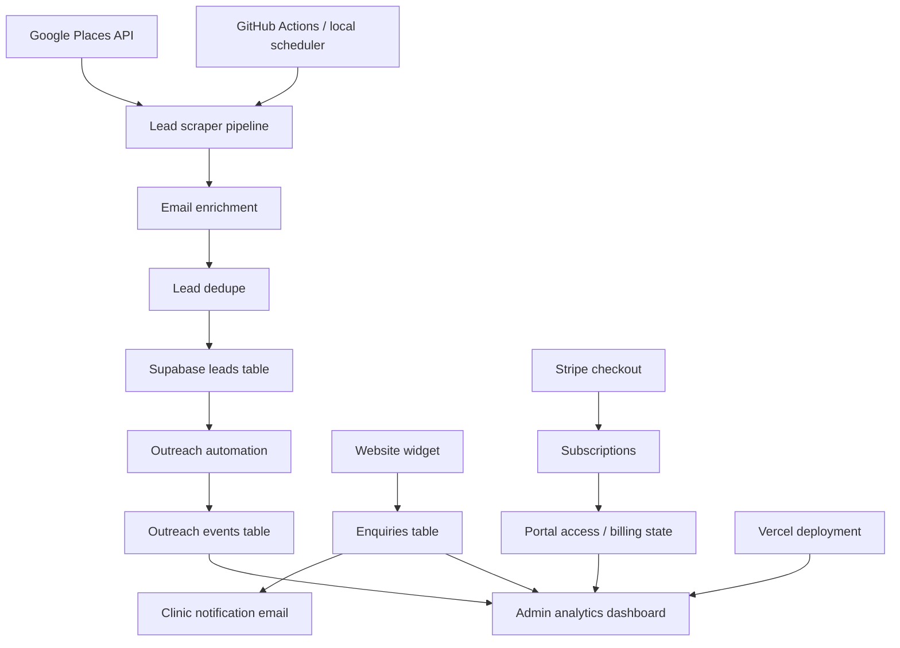

# LeadClaw.uk

## Automation OS for UK Beauty & Aesthetic Clinics

LeadClaw is a vertical SaaS platform built for UK aesthetic and beauty clinics.  
It combines automated enquiry capture, retention automation, lead generation, onboarding automation, and subscription billing into one operational system.

**Live Platform:** https://leadclaw.uk

---

# 🚀 What LeadClaw Does

LeadClaw reduces missed enquiries, manual follow-ups, and admin overload with structured automation:

- Automated website enquiry capture
- Trial → paid subscription automation
- Retention lifecycle workflows
- Lead scoring + outreach engine
- Automated onboarding installs
- Stripe subscription lifecycle management
- Admin operations dashboard
- Compliance logging + audit trail

---

# 🏗 System Architecture

LeadClaw is made up of two main parts:

1. **SaaS application**
   - Next.js
   - Supabase
   - Stripe
   - Admin analytics dashboard
   - Website widget / enquiry capture
   - Outreach tracking

2. **Lead generation pipeline**
   - Python
   - Google Places API
   - Enrichment scripts
   - Deduplication
   - Outreach trigger

## System Flow

