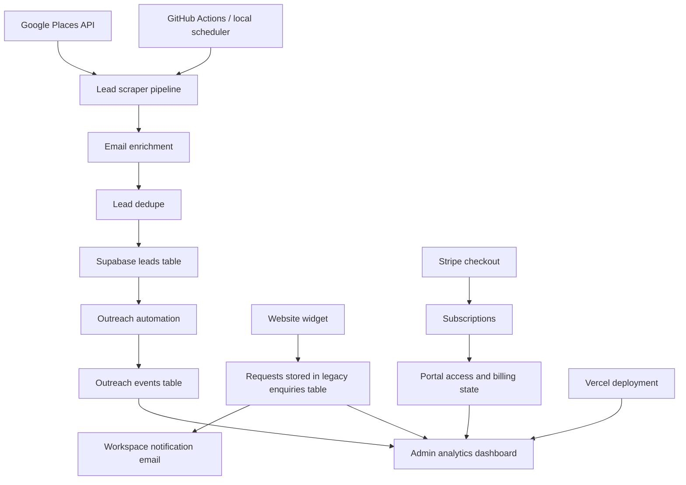

# LeadClaw.uk

## AI workflow automation suite for busy businesses

LeadClaw helps businesses capture requests, organise operational work, automate
follow-ups, and save hours on repetitive admin and data tasks with AI.

**Live Platform:** https://leadclaw.uk

---

## What LeadClaw Does

LeadClaw combines lightweight intake capture with practical AI workflow tools:

- AI Receptionist for website request capture
- Lead Tracker for workspace visibility
- Follow-Up Assistant for reminders and next steps
- Data Cleaner for messy forms, lists, and notes
- Document Extractor for structured detail capture
- Weekly Report Bot for recurring operational summaries
- Stripe subscription lifecycle management
- Admin operations dashboard
- Compliance logging and audit trail

---

## System Architecture

LeadClaw is made up of two main parts:

1. **SaaS application**
   - Next.js
   - Supabase
   - Stripe
   - Admin analytics dashboard
   - Website widget and request capture
   - Outreach tracking

2. **Lead generation and workflow pipeline**
   - Python
   - Google Places API
   - Enrichment scripts
   - Deduplication
   - Outreach trigger

Legacy database and API names such as `clinics`, `clinic_id`, and `enquiries`
are intentionally retained for compatibility during the positioning revamp.

## System Flow

```mermaid
flowchart TD
    A[Google Places API] --> B[Lead scraper pipeline]
    B --> C[Email enrichment]
    C --> D[Lead dedupe]
    D --> E[Supabase leads table]
    E --> F[Outreach automation]
    F --> G[Outreach events table]
    G --> H[Admin analytics dashboard]

    I[Website widget] --> J[Requests stored in legacy enquiries table]
    J --> K[Workspace notification email]
    J --> H

    L[Stripe checkout] --> M[Subscriptions]
    M --> N[Portal access and billing state]
    N --> H

    O[GitHub Actions / local scheduler] --> B
    P[Vercel deployment] --> H
```
